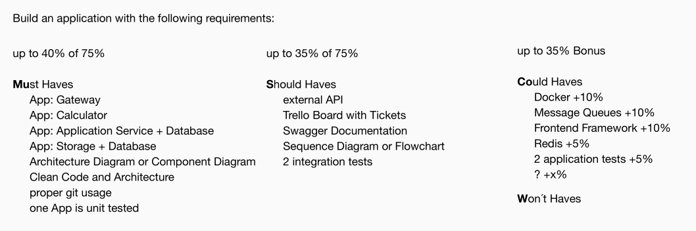
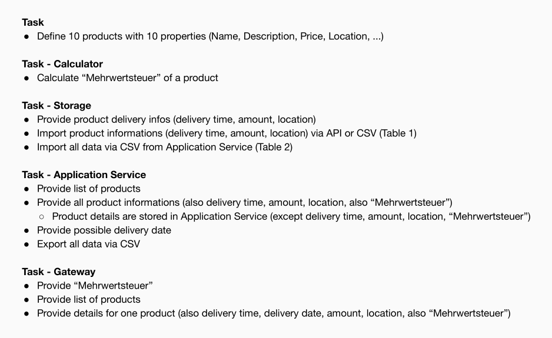
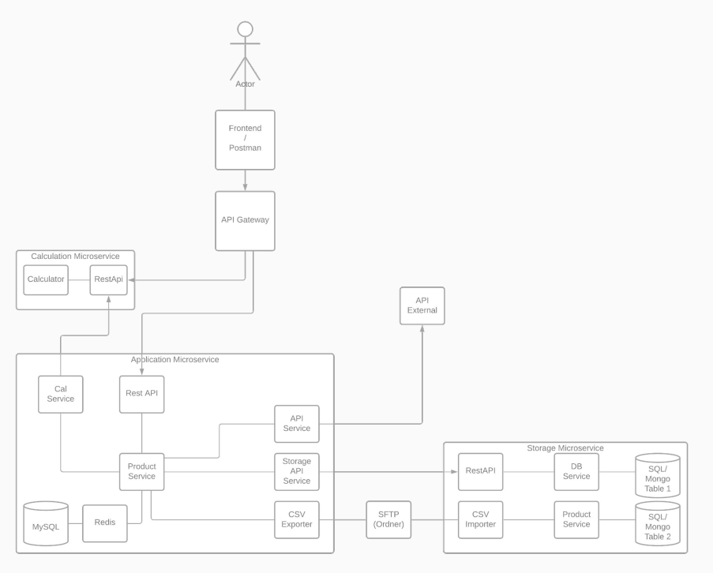

# htw-kbe

A microservice architecture in TypeScript, connected through message queue RPC
calls.

This was a uni project as part of Komponentenbasierte-Entwicklung.

## requirements

The requirements for the application were:



With the specific tasks for the components and the proposed architecture:

<details>


</details>

## solution

Everything is available in [this GitHub Organization](https://github.com/htw-kbe-jneidel).

Planning and orga:
- [diagrams](https://github.com/htw-kbe-jneidel/planning/tree/drawio#diagrams)
- [specifications](https://github.com/htw-kbe-jneidel/planning/tree/master#planning)

Components providing services through message queue RPC calls:
- [product](https://github.com/htw-kbe-jneidel/product): The primary database holding business data.
- [storage](https://github.com/htw-kbe-jneidel/product): The secondary database holding business data. To simulate a source of data, separate from the main database.
- [vat-calculator](https://github.com/htw-kbe-jneidel/vat-calculator): Provide calculation Mehrwertsteuer services.
- [distance-calculator](https://github.com/htw-kbe-jneidel/distance-calculator): Provide walking distance calculation services.
- [csv-export](https://github.com/htw-kbe-jneidel/csv-export): Expose CSV export capabilities.

HTTP accessible components:
- [gateway](https://github.com/htw-kbe-jneidel/gateway): Central entry point
into the app, providing redirects to the other HTTP services.
- [API](https://github.com/htw-kbe-jneidel/api): Making the above message queue
RPC calls available through HTTP requests.
- [frontend](https://github.com/htw-kbe-jneidel/frontend): A user interface for rendering the data.

## install

```
git clone --recurse-submodules -j4 git@github.com:htw-kbe-jneidel/main.git
npm run install
```

## start

```
./scripts/start-dependencies
npm start
```

Dependencies:
- Rabbit MQ
- MongoDB
- Redis

## tests

- System tests:
```sh
./scripts/system-test
```
- Integration tests:
```sh
npm test --prefix storage
npm test --prefix product
```
- Unit tests:
```sh
npm test --prefix vat-calculator
```
